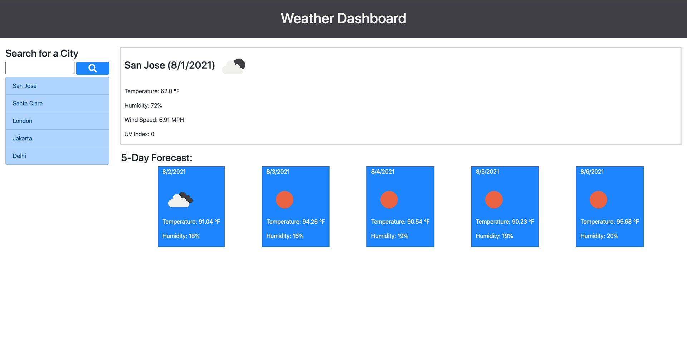

# Weather-Dashboard

### This Web Application is a Weather Dashboard built using Open Weather API, Bootstrap, and JQuery. 

The application displays the 5 day forecast of a city selected by the user, in addition to advanced same-day stats. The app also saves users' previously searched cities for easy access.

You can access the Web App here: [Weather Dashboard Web App](https://github.com/saumilkt/Weather-Dashboard)